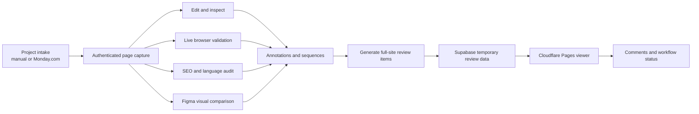
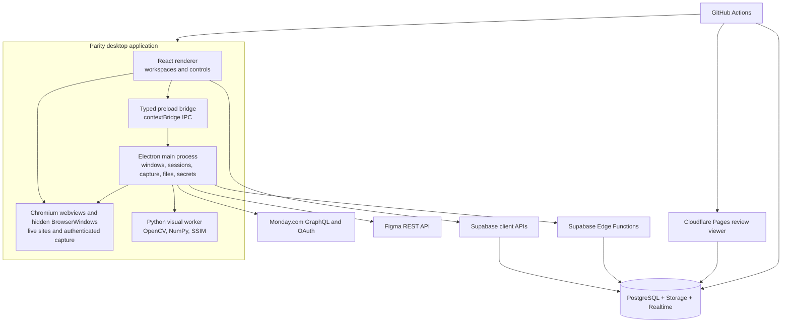

# Parity Application Overview

**Document purpose:** Software proposal and technical architecture reference  
**Application:** Parity  
**Current implementation reviewed:** v1.3.7  
**Platform:** Windows desktop application with a web-based review portal  

## 1. Executive summary

Parity is a desktop quality-assurance workspace for reviewing website implementations from capture through stakeholder approval. It brings together page capture, browser-like inspection, visual editing, responsive testing, on-page SEO auditing, Figma-to-implementation comparison, annotations, issue sequencing, private notes, and shareable review links in one application.

The product is designed for QA engineers, web developers, designers, project managers, and clients who need to answer four practical questions:

1. Does the implemented website match the intended design?
2. What visual, content, responsive, or SEO issues remain?
3. Where is each issue located, and what is its current workflow status?
4. How can the findings be shared without requiring every reviewer to install the desktop application?

Parity uses a hybrid local/cloud architecture:

- The Electron desktop application performs authenticated website rendering, page capture, inspection, editing, image processing, and private local file handling.
- A React interface provides the Dashboard, Edit, Live, Audit, Automate, Notes, capture, annotation, and settings experiences.
- A Python/OpenCV worker performs computationally intensive visual comparison outside the UI process.
- Supabase provides temporary review data, annotation collaboration, account-scoped project data, and private rich-text note synchronization.
- Cloudflare Pages hosts the public Parity landing page, installer entry point, and browser-based review viewer.
- GitHub Actions validates, packages, publishes, and deploys the desktop application, viewer, and database changes.

Parity is not a production website builder or deployment system. Edits and annotations are made against a captured or live review representation; they do not automatically modify the remote staging or production server. This separation makes the product suitable for review, validation, handoff, and evidence generation without introducing unintended changes to the website under test.

## 2. Product scope and value proposition

### 2.1 Primary users

| User | Primary use in Parity |
| --- | --- |
| QA engineer | Capture pages, inspect layouts, run responsive and SEO checks, annotate defects, and verify fixes. |
| Front-end developer | Inspect computed styling and box-model values, compare implementation against design, and receive precise visual evidence. |
| Designer | Compare Figma frames with rendered pages and review typography, spacing, colors, images, and alignment. |
| Project manager | Organize work from Monday.com, track issue status, review generated links, and coordinate implementation feedback. |
| Client or stakeholder | Open an expiring browser link, navigate annotations and sequences, comment, and update review status. |

### 2.2 End-to-end workflow



### 2.3 Core outcomes

- A reproducible local representation of an authenticated or public webpage.
- A responsive inspection canvas with direct element selection and editing tools.
- A browser-faithful Live workspace for behavior and viewport validation.
- A structured SEO, content, grammar, and spelling review.
- Automated design-versus-implementation evidence using visual and semantic signals.
- Precise, viewport-aware annotations that can be grouped into ordered sequences.
- Expiring browser links for external review, commenting, and status updates.
- Private, account-scoped notes and project organization for ongoing QA work.

## 3. High-level architecture

Parity is divided into five principal runtime layers.



### 3.1 Electron main process

The Electron main process is the trusted desktop service layer. It owns operations that require native access, privileged browser access, filesystem access, protected credentials, or long-running computation.

Primary responsibilities include:

- Creating and managing the application, authentication, Figma, capture, and detached windows.
- Maintaining Chromium sessions and cookies used by authenticated staging sites.
- Capturing rendered pages in hidden `BrowserWindow` instances.
- Driving Chrome DevTools Protocol capture for the Automate workspace.
- Creating, listing, and deleting local snapshots.
- Persisting projects, workspace HTML, note attachments, and application data.
- Encrypting Figma and Monday credentials with Electron `safeStorage`.
- Calling Monday.com and Figma APIs without exposing sensitive credentials to the renderer.
- Starting, monitoring, and cancelling the Python visual-comparison worker.
- Processing images with Sharp.
- Coordinating GitHub-based desktop updates through `electron-updater`.

### 3.2 Preload and IPC boundary

The renderer does not receive unrestricted Node.js or filesystem access. A preload script exposes a typed, purpose-specific API through Electron `contextBridge`.

The bridge covers:

- WordPress/staging authentication and capture.
- Project and account-state persistence.
- Workspace HTML caching.
- Snapshot creation and management.
- Note attachment storage and opening.
- Monday.com authentication, metadata, and ticket retrieval.
- Figma authentication, token status, frame discovery, and frame image retrieval.
- Automate capture, visual comparison, progress, and cancellation.
- Grammar and spelling analysis.
- External links and detached windows.
- Application cache and window controls.
- Update checks, downloads, install actions, and update events.

This boundary reduces the renderer's authority and gives the desktop application a clearly defined security and testing surface.

### 3.3 React renderer

The React renderer contains the application shell and user-facing workspaces. It owns transient UI state, canvas interactions, panels, annotations, audit presentation, comparison evidence, and orchestration through the preload API.

Major renderer modules include:

- `App.tsx`: multi-tab application shell, navigation, project opening, capture hydration, activity bar, settings, and updates.
- `Dashboard.tsx`: project organization, Monday work, folders, pinned and active projects, search, sorting, and trash.
- `CaptureScreen.tsx`: authentication and capture intake.
- `EditorWorkspace.tsx`: shared workspace shell, toolbar, annotation system, device controls, snapshots, Figma views, QA tracker, and Generate Items.
- `EditBetaWorkspace.tsx`: live DOM selection, canvas transforms, inspection overlays, multi-selection, and inline editing.
- `SeoAuditRightPanel.tsx` and `SeoAuditWorkspace.tsx`: on-page SEO and language audit presentation.
- `AutomateWorkspace.tsx`: Figma comparison workflow and result triage.
- `FullsiteCanvasModal.tsx`: full-page review generation and share-link management.
- `NotesWorkspace.tsx`: account-scoped rich-text notes.

### 3.4 Chromium rendering surfaces

Parity uses several rendering surfaces because each workspace has different requirements:

- Hidden `BrowserWindow` instances render and extract initial captures using the authenticated default session.
- Electron `<webview>` guests provide live browsing and browser-faithful site rendering.
- Captured/frozen HTML is loaded into editable canvas frames for local inspection and modification.
- Figma is displayed either through authenticated embedded web content or a rendered PNG.
- Chrome DevTools Protocol is attached to a guest renderer for deterministic Automate capture and semantic DOM extraction.

### 3.5 Python visual-analysis worker

Heavy image analysis is isolated in a Python process so large image arrays and OpenCV operations do not block React or Chromium. The worker accepts a design image and a live-site image, aligns them, calculates similarity, detects changed regions, and returns structured JSON plus generated image artifacts.

In development it runs through Python. In packaged Windows builds it is bundled as a standalone executable with PyInstaller and included as an Electron resource.

### 3.6 Cloud collaboration layer

Supabase is used for two distinct domains:

1. **Account-scoped application data**: Monday-verified identity, user settings/state, project metadata, and rich-text notes.
2. **Ephemeral QA sharing**: captured review images, annotations, annotation sequences, comments, rich-text assets, and workflow statuses.

Cloudflare Pages hosts a static viewer that reads the temporary review records and storage objects directly through the configured Supabase public API. Supabase Realtime keeps annotation comments and statuses synchronized for open viewers.

## 4. Core application shell

### 4.1 Multi-tab desktop experience

Parity supports multiple in-app tabs so users can keep the Dashboard, Notes, and several projects open at the same time. Tab metadata is retained for the current session, while large captured HTML documents are moved to a filesystem-backed workspace cache rather than browser storage. This avoids `sessionStorage` and `localStorage` quota failures on large pages.

Key shell behaviors include:

- Add, activate, close, and restore tabs.
- Keep one project open in a reusable tab.
- Return a project tab to the Dashboard.
- Persist captured workspace HTML to Electron application data.
- Hydrate workspace HTML after reload or process restart.
- Surface update availability, download progress, and restart-to-install actions.
- Show or pin a compact activity/navigation bar for Dashboard and Notes access.

### 4.2 Dashboard

The Dashboard is the operational home for projects and incoming QA work.

#### Project management

- Create a new capture manually.
- Store a project name, staging URL, admin URL, Figma URL, Google Sheet URL, Monday ticket association, timestamps, thumbnail, workflow state, and workspace data.
- Open an existing project and recapture its current staging page.
- Edit project metadata without changing its folder or ticket association.
- Search projects by title or URL.
- Sort projects by recency and other available ordering options.
- Use responsive grid or tabular list view.
- Pin high-priority projects.
- Maintain an Active Projects section.
- Display current request/status information.
- Generate and refresh project thumbnails from captured pages.

#### Folder organization

- Create, rename, collapse, and delete folders.
- Move projects between folders and the unfiled/active area.
- Drag and drop projects into folders.
- Return folder contents to Active Projects when a folder is removed.
- Keep project counts at the folder level.

#### Trash lifecycle

- Soft-delete projects to Trash.
- Restore trashed projects.
- Permanently delete when required.
- Configure automatic trash purge after a selected number of days, or retain manual-only cleanup.

#### Responsive presentation

Grid and list layouts are applied consistently to normal folders, pinned projects, active projects, Monday work, and trash. Cards and rows expand to the available container width and adapt at narrower desktop-window sizes.

### 4.3 Monday.com work intake

Monday.com can be used as both the user's Parity identity and an optional work-source integration.

Implemented capabilities include:

- OAuth-based connection through a local callback flow.
- Personal API token fallback if browser authorization is unavailable.
- Secure token persistence in the Electron main process.
- Selection of accessible Monday boards.
- Filtering work assigned to the current user, all accessible users, or selected users.
- Search across tickets, boards, people, and linked resources.
- Board and status filters.
- Sorting by update time, name, board, or status.
- Grouping work by Monday status.
- Importing ticket title, admin URL, staging URLs, Figma link, and Google Sheet link.
- Handling tickets with multiple possible staging URLs.
- Activating/deactivating tickets as Parity projects.
- Manual synchronization plus a configurable background sync interval.

### 4.4 Capture intake

The capture screen supports both public websites and authenticated WordPress-style staging environments.

The user can:

- Enter a WordPress admin URL and authenticate in a visible Electron window.
- Skip login for public pages.
- Enter or select a staging URL.
- Autofill URLs and related resources from Monday tickets.
- Choose among multiple staging links discovered on a ticket.
- Associate an optional Figma design URL.
- Associate an optional Google Sheet URL.
- Recapture an existing project.
- Continue with a captured result after a login/404 warning when the user intentionally accepts it.

The default Electron session is shared by authentication and capture surfaces so session cookies remain available to the page renderer.

## 5. Capture and snapshot engines

### 5.1 Rendered HTML capture engine

Initial page capture is performed by `captureUrl()` in a hidden Chromium window rather than by a simple HTTP request. This is essential for JavaScript-rendered sites, page builders, authenticated sessions, lazy-loaded media, and browser-resolved styles.

The pipeline:

1. Normalizes the requested URL.
2. Creates a hidden 1920-pixel-wide browser surface using the default authenticated session.
3. Clears stale cache and loads the page with no-cache headers.
4. Waits for document load and late JavaScript rendering.
5. Detects WordPress login redirects and likely 404 pages.
6. Scrolls the document to trigger IntersectionObserver and scroll-based lazy loading.
7. Preserves revealed animation states and returns to the top.
8. Converts relative document and asset references to absolute URLs.
9. Reads accessible styles through the browser CSSOM.
10. Retrieves otherwise inaccessible stylesheets through Electron's `net` API using session cookies and browser-like headers.
11. Recursively resolves CSS `@import` rules and relative `url(...)` references.
12. Extracts the rendered document HTML.
13. Freezes the snapshot by resolving lazy sources, removing executable scripts and inline event handlers, and retaining the styles required for local rendering.

This capture path is designed for common WordPress, Elementor, WooCommerce, Oxygen, cached CSS, CDN, and WAF-protected staging setups. Capture success still depends on the target site's authentication, anti-bot policy, network availability, and runtime behavior.

### 5.2 Filesystem-backed workspace HTML

Captured HTML can exceed browser storage quotas. Parity therefore stores the large document in Electron application data under a hashed tab identifier and persists only lightweight tab metadata in `sessionStorage`.

Writes use a temporary file followed by a rename to reduce the chance of partial documents. Legacy browser-stored workspace HTML is migrated opportunistically.

### 5.3 Snapshot engine

The snapshot subsystem creates versioned project artifacts independent from the current editable state.

Supported artifacts include:

- Full-page image snapshots.
- Interactive frozen HTML snapshots.
- Single-device captures.
- Multi-device capture sets.
- Desktop, tablet, mobile, and custom viewport metadata.
- Snapshot listing, preview, overlay selection, filtering, and deletion.

Full-page image capture uses controlled scrolling and overlapping screenshot tiles. It prepares lazy-loaded images and animation-driven content, detects fixed and sticky elements, and prevents those elements from being repeated in every tile. Sharp composites the tiles into a single PNG or JPEG-compatible artifact. Snapshot data and metadata are stored under the Electron application-data directory and indexed by project.

### 5.4 Capture reliability measures

The current capture implementation includes defenses for recurring browser-capture edge cases:

- Browser cache clearing before fresh capture.
- CSSOM extraction with network fallback for styles blocked by CORS.
- Session-aware resource retrieval.
- Lazy asset normalization.
- Scroll verification and overlap between image tiles.
- Fixed/sticky element auditing before and during scrolling.
- Bottom-anchored element placement on the appropriate final tile.
- Duplicate-tile and stalled-scroll detection in Automate capture.
- Image-area and document-height limits to avoid pathological memory allocation.
- Filesystem storage for large HTML payloads.
- Progress, timeout, cancellation, and cleanup paths.

## 6. Shared workspace canvas and toolbar

Edit, Live, Audit, and Automate are presented within a shared project shell. Workspace transitions preserve project context, viewport information, annotations, and relevant panel state.

Common project-level capabilities include:

- Workspace switching between Edit, Live, Audit, and Automate.
- Desktop, tablet, mobile, and custom viewport sizes.
- Editable viewport width and height values.
- Device preset list.
- Single-device and multi-device views.
- Zoom controls and keyboard/mouse zoom gestures.
- Canvas panning and free-transform mode.
- Annotation creation and selection where supported.
- Project-local undo/redo and history where supported.

Tools appear or disappear based on the active workspace. The Live workspace intentionally removes edit-only inspection and annotation controls so the site behaves like a normal browser; transitions animate the tool groups instead of abruptly reflowing the entire toolbar.

## 7. Edit Workspace

The Edit Workspace is the primary manual inspection and visual QA environment. It combines a Chromium-rendered page representation with a responsive canvas, DOM-aware selection, style inspection, overlays, annotations, snapshots, design comparison, and QA tracking.

### 7.1 Canvas and responsive simulation

- Pan the canvas independently of the rendered page.
- Zoom in, zoom out, reset, and use pointer-centered zoom.
- Resize the simulated site viewport with free-transform handles.
- Use pointer capture during resize so fast mouse movement does not drop the drag operation.
- Enter precise width and height values.
- Switch among Desktop, Tablet, Mobile, named device presets, and custom sizes.
- View one device at a time or arrange several breakpoints on the canvas.
- Preserve responsive CSS rules and media-query behavior from the captured site.
- Keep canvas controls responsive across application window sizes.

### 7.2 Interaction modes

- **Interact:** allows normal links, scrolling, and page interaction.
- **Edit:** selects and modifies elements in the captured document.
- **Eyedropper:** samples visible colors and identifies the associated CSS property; the sampled value can be copied.

### 7.3 Element selection

- Click an element in the canvas or select it from the layer tree.
- Hold Ctrl/Cmd to add or remove elements from a multi-selection.
- Deselect the active set without losing workspace state.
- Highlight selected elements with accurate frame-relative geometry.
- Synchronize selection with the style inspector and overlay subsystems.
- Support selection across the editable Chromium surface while excluding Parity's own injected controls.

### 7.4 DOM and layer inspection

- Browse a hierarchical DOM/layer tree.
- Expand and collapse nested elements.
- Refresh the live DOM representation.
- Identify element tag, attributes, classes, and source path.
- Select layers from the tree and reflect that selection on canvas.
- Inspect colors and fonts used by the captured page.

### 7.5 Style and box-model editing

The style panels expose commonly reviewed or modified computed properties, including:

- Typography: family, size, weight, line height, letter spacing, alignment, text decoration, text transform, and color.
- Display and layout: block, inline-block, flex, grid, none, direction, wrapping, justification, alignment, and gap.
- Spacing: independent margin and padding values for all sides.
- Dimensions: width, height, minimum and maximum bounds.
- Position: static, relative, absolute, fixed, sticky, offsets, z-index, and overflow.
- Background: color and image-related values.
- Border and radius.
- Opacity, shadow, and other visual effects surfaced by the native inspector.
- Raw/inline CSS editing through the CSS inspector.

Numeric controls support direct entry, and applicable controls support drag/scrub interaction. Changes are applied to the local captured document, reflected immediately on the canvas, and recorded for undo/redo. The edited HTML can be persisted in the workspace cache, but Parity does not publish these modifications to the remote website.

### 7.6 Inline content editing

- Edit supported text content directly in the rendered document.
- Commit or cancel local changes.
- Preserve the surrounding DOM and styling.
- Record content/style mutations in local history.

### 7.7 Boundaries and font inspection

The inspection overlay system can render either all matching elements or only the current selection, including multi-selected elements.

Boundary options include:

- Element dimensions.
- Margin values and margin visualization.
- Padding values and padding visualization.
- Flex/grid gap values.
- Selected-elements scope.
- All-elements scope.

Font overlays report font family, size, weight, and related typography data. Font chips are placed at the top-left of an element, while boundary chips are placed at the top-right to avoid overlap. Both chip systems counter-scale against canvas zoom so the labels remain legible when the page is zoomed out.

### 7.8 Rulers and guides

- Toggle horizontal and vertical rulers.
- Drag guides from the rulers onto the canvas.
- Display guide coordinates.
- Move or remove guides.
- Configure guide layouts for consistent spacing and alignment checks.
- Include applicable ruler/guide data in inspection capture overlays.

### 7.9 Panels and workspace layout

- Toggle left, bottom, and right panels.
- Resize panel regions.
- Use the left side for annotations/layers/history.
- Use the right side for colors, fonts, styles, SEO information, or contextual details.
- Use the bottom area for the QA tracker and related embedded resources.
- Save relevant panel visibility and sizing preferences locally.

### 7.10 Figma and snapshot comparison

The Edit Workspace can compare the page against either a Figma design or a saved site snapshot.

Supported modes include:

- Figma live embed in a resizable side panel.
- Uploaded or pasted Figma PNG.
- Saved site snapshot as comparison source.
- Side-by-side comparison.
- Opacity overlay.
- Pixel-difference visualization.
- Interactive split/slider comparison where available in the comparison modal.
- Synchronized scroll/position behavior for overlays.
- Adjustable overlay opacity and visibility.

### 7.11 Record and before/after evidence

Record captures the current viewport before a set of local edits, tracks the resulting document changes, captures the after state, and opens a before/after snipping workflow. The evidence studio provides side-by-side and interactive wipe views; arrow, text, rectangle, circle, and pen markup; color selection; undo/redo; and clear actions. The composed result can be copied to the clipboard, downloaded as a PNG, or saved into the project's snapshots.

### 7.12 Embedded QA tracker

Parity embeds FortuneSheet as an in-app QA spreadsheet and can also display a linked Google Sheet. The default QA tracker structure includes implementation-oriented fields such as page link, section, screenshot, remarks, and status. The bottom dock can be collapsed, expanded, and resized without leaving the project workspace.

### 7.13 Missing-font handling

The editor scans rendered font families, distinguishes common system/icon fonts, checks whether fonts are actually rendering, and reports missing families. Supported CDN font resources can be injected when the user chooses to load them. This helps preserve visual fidelity when the captured page references fonts unavailable in the local renderer.

## 8. Live Workspace

The Live Workspace provides a browser-like view of the target website inside Parity. It is intended for validating navigation, interactions, scroll behavior, responsive layout, authenticated state, and dynamic page behavior without editor overlays intercepting the page.

### 8.1 Browser behavior

- Navigate to the project's live/staging URL.
- Back, forward, and reload controls.
- Editable address display.
- Normal page interaction, scrolling, focus, and link behavior.
- Shared Electron session for sites that require existing login state.
- Browser-faithful CSS and JavaScript execution inside the guest renderer.

### 8.2 Retained Live controls

The Live toolbar intentionally retains only controls needed for browser and responsive testing:

- Edit, Live, Audit, and Automate workspace switching.
- Free Transform mode.
- Single-device view.
- Multi-device view.
- Desktop, Tablet, and Mobile presets.
- Viewport width and height inputs.
- Device-list dropdown.
- Zoom controls.

Edit-only cursor modes, recording, annotations, Generate Items, rulers, boundary/font inspection, design/snapshot overlays, and editor panels are hidden in Live. Canvas panning, zoom, viewport resizing, and device switching remain active and are isolated from the corresponding Edit controls so changing workspace does not disable Edit gestures.

## 9. Annotation and issue-management system

Annotations are the common issue representation across manual review, Audit, Automate, Generate Items, and the external viewer.

### 9.1 Annotation types

- Element/box annotation.
- Arrow.
- Rectangle.
- Circle.
- Freehand pen path.
- Text callout.
- Blur/redaction region.

Each annotation can store:

- Stable ID and visible badge number.
- Title and rich-text notes.
- Color.
- Annotation type and shape geometry.
- Element/DOM path when linked to a page element.
- Source finding ID when created from Automate.
- Viewport key, device name, device type, width, and height.
- Pixel and percentage-based page coordinates.
- Sequence parent and order.

Percentage-based geometry allows annotations to remain aligned when the full capture is rendered at different display scales.

### 9.2 Annotation creation and editing

- Draw directly over the page or select an element as the issue region.
- Move and resize annotations with pointer-captured gestures.
- Enter a title and formatted description.
- Choose an annotation color.
- Select annotations from the canvas or sidebar.
- Delete annotations and clean up any sequence membership.
- Maintain annotations separately for different viewport/device frames.
- Create annotations from selected Automate findings, individually or in a batch.

### 9.3 Annotation sequences

Related annotations can be connected into an ordered sequence, with the first annotation acting as the parent.

Implemented sequence interactions include:

- Input and output nodes on annotation bounds.
- Drag from one node to another to create a link.
- Click one node and then another as an alternative to dragging.
- Prioritize an active node-link gesture over canvas selection, panning, annotation movement, and other pointer handlers.
- Render directional curved connectors with arrowheads.
- Insert a new annotation after the chosen source position.
- Re-normalize parent and order if a member is removed.
- Store the parent-first ordered sequence with the shared snapshot.
- Display sequence grouping, position, previous, and next navigation in the browser viewer.

### 9.4 Annotation workflow status

Shared annotations support the following workflow states:

- Requested.
- In progress.
- Completed.
- Rejected.
- Approved.
- Invalid.
- Enhancement.
- PM clarification.

Statuses are stored separately from the immutable capture geometry so they can be updated collaboratively. Supabase Realtime distributes status changes to connected viewers.

## 10. Generate Items and external review

Generate Items converts the current reviewed page into a shareable, full-site evidence package.

### 10.1 Generation workflow

1. Capture the complete document, not only the currently visible viewport.
2. Preserve correct page width and detected document height.
3. Remove capture-only editor UI and avoid duplicated page frames.
4. Stitch scrolling tiles into one master image.
5. Suppress repeated fixed or sticky headers after their appropriate tile.
6. Map page annotations and inspection overlays into image coordinates.
7. Render annotation shapes and sequence connectors over the master capture.
8. Generate a master link and one focused item link per annotation.
9. Upload temporary image objects and metadata to Supabase.

The Generate Items modal provides:

- Full capture preview on a pan/zoom canvas.
- Master capture dimensions and viewport metadata.
- Annotation list and item count.
- Sequence visualization.
- Annotation editing before publication.
- Master-link copy action.
- Individual item-link copy action.
- Copy-all-links action.
- Upload progress, success, and error states.

### 10.2 Cloudflare Pages viewer

The viewer supports recipients who do not have Parity installed. Depending on the link, it displays the master page or a focused annotation item.

Viewer features include:

- Responsive capture display.
- Annotation shapes, labels, colors, and inspection overlays.
- Focused annotation lightbox/modal.
- Annotation picker and direct jump navigation.
- Ordered sequence grouping and directional connectors.
- Previous/next sequence navigation.
- Annotation title and rich-text description.
- Shared workflow-status selection.
- Comment thread per annotation.
- Rich-text comment formatting and links.
- Compressed image attachments in comments.
- Image lightbox.
- Capture dimensions and expiration information.
- Realtime refresh of comments and statuses.

The same Cloudflare Pages site also serves the minimalist Parity product landing page and the one-line PowerShell installation flow when no review parameters are present.

### 10.3 Ephemeral sharing model

Generated review artifacts expire by default rather than becoming permanent public files. The cloud model includes:

- A private Supabase Storage bucket for full-page images, item crops, and rich-text images.
- Snapshot metadata keyed by site slug, master capture ID, and item number.
- Expiration timestamps on snapshots and registered rich assets.
- RLS rules that allow active review data to be read while it remains unexpired.
- Scheduled/database-assisted cleanup functions for expired objects and related rows.
- Link-based anonymous collaboration for comments and status changes.

This is appropriate for temporary implementation review. A proposal requiring named external reviewers, organization membership, audit trails, or permanent evidence retention would extend this model with authenticated reviewer identities and tenant-level authorization.

## 11. Audit Workspace

The Audit Workspace analyzes the captured page as a structured document and overlays selected findings on the visual canvas.

### 11.1 SEO scoring

The audit engine returns a score from 0 to 100 and classifies checks as error, warning, pass, or informational. The UI displays total errors, warnings, passed checks, category filters, severity filters, and search.

### 11.2 Metadata checks

- Presence and length of the document title.
- Recommended title range of approximately 50–60 characters.
- Presence and length of the meta description.
- Recommended description range of approximately 120–155 characters.
- Canonical URL.
- Meta keywords visibility for inspection.
- Open Graph title, description, and image.
- Twitter Card metadata.
- Search/social preview information.

### 11.3 Heading and content checks

- Missing H1.
- Multiple H1 elements.
- Confirmation of a single H1.
- Complete heading inventory.
- Page word count.
- Duplicate visible content across headings, paragraphs, and common page-builder title elements.
- Searchable issue title, description, recommendation, severity, and details.

### 11.4 Image checks

- Total image inventory.
- Missing `alt` attributes.
- Empty decorative alt text distinction.
- Image source and dimensions where available.
- Missing-alt count and coverage summary.

### 11.5 Link and asset checks

- Link text and href inventory.
- Internal versus external links.
- Follow/nofollow information.
- Missing or invalid href indicators.
- JavaScript and stylesheet dependency inventory derived from capture metadata and document resources.
- Internal versus external asset classification.

### 11.6 Grammar and spelling

The language audit combines Harper with an English dictionary/nspell fallback. It extracts visible semantic text, scans asynchronously, and returns element-level grammar and spelling issues.

Capabilities include:

- Automatic scan on audit load.
- Rescan after captured content changes.
- All, spelling-only, and grammar-only filters.
- Context, explanation, and suggested replacement.
- Apply an available correction to the captured document.
- Detect stale issue ranges when the source text has changed.
- Report which language engines were available and any fallback warnings.

### 11.7 Canvas audit overlays

Users can independently toggle overlays for:

- Links.
- Alt text.
- Href values.
- Heading hierarchy.
- Grammar and spelling issues.

The Audit Workspace uses the same responsive canvas and can convert actionable findings into normal project annotations for the shared review workflow.

### 11.8 Reporting

Audit results can be summarized in a Markdown-style report containing the score, error/warning/pass totals, metadata, headings, image coverage, link counts, and issue recommendations. This can be copied into an external ticket, QA report, or proposal appendix.

## 12. Automate Workspace

Automate is Parity's design-conformance and visual-regression engine. It compares a selected full-page Figma frame with a freshly rendered staging page using two complementary signals:

1. Pixel/structural visual comparison.
2. Semantic DOM-to-Figma layer comparison.

This combination catches visual differences that have no meaningful DOM representation while also producing explainable findings such as missing text, position changes, typography mismatches, and page-height differences.

### 12.1 Figma connection and frame selection

- Store a Figma personal access token encrypted with operating-system credential protection.
- Validate the Figma identity endpoint and use file-content read access for frame comparison.
- Validate token status without returning the raw token to React.
- Accept Figma design, file, and prototype URLs.
- Parse a supplied `node-id` and preselect that node when possible.
- Discover top-level frames, components, and sections with dimensions.
- Display file name, page name, frame name, type, width, and height.
- Retrieve selected-node JSON and a scale-1 rendered PNG through the Figma REST API.
- Select or override Desktop, Tablet, or Mobile breakpoint labeling for run history.

### 12.2 Browser-faithful live capture

Automate renders the staging page in an Electron webview and captures it through Chrome DevTools Protocol. It does not rebuild the page from static HTML or route it through GrapesJS.

The capture engine:

- Applies a viewport width matching the selected design frame.
- Measures the actual live document height independently.
- Pauses animations during capture.
- Performs a complete scrolling pass to trigger lazy content.
- Uses bounded, overlapping tiles rather than an extremely tall browser surface.
- Verifies the browser reached each requested scroll location.
- Detects stalled scrolling and identical consecutive images.
- Hides fixed/sticky elements after the first appropriate tile.
- Uses Sharp to compose tiles on an opaque image canvas.
- Extracts visible semantic DOM nodes after the scroll pass.
- Restores animation, scroll, visibility, and device-emulation state.
- Reports progress and supports cancellation and timeout cleanup.

### 12.3 Semantic extraction

The live scanner extracts visible text and structural information from headings, paragraphs, links, buttons, labels, list items, spans, leaf text containers, tables, form inputs, images, sections, articles, headers, footers, navigation, and main content.

For each relevant node it can record:

- Tag and ARIA role.
- Accessible or visible text.
- Image source.
- DOM path and limited identifying context.
- Nearby/section heading context.
- Document-relative geometry.
- Font family, size, and weight.
- Foreground and background color.
- Text alignment and position mode.

Coordinates are normalized into document space so findings remain valid after a long scrolling capture.

### 12.4 Semantic matching engine

Figma layers are not expected to share class names or component names with WordPress or page-builder markup. Matching instead uses:

- Normalized visible text.
- Exact, containment, and token-overlap similarity.
- Relative design/live geometry.
- Nearby section context.
- Heading affinity.
- One-to-one candidate reservation.

The semantic engine identifies findings such as:

- Missing design text.
- Position mismatch.
- Font-size mismatch.
- Image-count mismatch.
- Full-page height mismatch or verification.
- Container shift and spacing mismatch where detectable.
- Design-token differences for colors and typography.
- Verified/no-material-mismatch results.

### 12.5 Visual comparison engine

The Python worker uses:

- NumPy for image and coordinate arrays.
- OpenCV for image loading, resizing, edge extraction, template/anchor matching, remapping, masks, morphology, contours, and heatmap generation.
- scikit-image for Structural Similarity Index (SSIM).

The engine vertically registers long design and live images, calculates overall similarity and changed-pixel percentage, segments significant difference regions, and calculates per-section scores. A JavaScript canvas comparison remains available as a fallback if the native worker cannot execute.

### 12.6 Results and evidence

Automate presents:

- Overall visual similarity.
- Changed-pixel percentage.
- High-, medium-, low-, and verified-finding counts.
- A conformance score that combines pixel and finding penalties.
- Diff, Figma, and Live full-page views.
- Focused Figma-versus-live evidence for a selected finding.
- Bounding boxes, dimensions, coordinates, connector, and calculated deltas.
- Finding confidence.
- Design-token details, with expandable extended tokens.
- Auto-detected page sections with per-section SSIM scores.

### 12.7 Finding filters and triage

Findings can be filtered by:

- All.
- Tokens.
- Layout.
- Missing/content.
- Verified.

Non-pass findings can be triaged as:

- Accepted baseline.
- False positive.
- Ignored.
- Reset to active.

Triaged findings can be hidden or shown. Actionable findings can be pinned as page annotations one at a time or in a selected batch.

### 12.8 Run history

Parity stores lightweight run summaries per Figma frame and breakpoint. A history entry includes timestamp, breakpoint, similarity, changed pixels, conformance score, finding total, and severity counts. The UI compares the latest score with the previous run at the same breakpoint to show improvement or regression trends.

### 12.9 Operational interpretation

Automate is a decision-support tool, not an absolute design oracle. Dynamic content, font rendering, anti-aliasing, animations, ads, third-party widgets, responsive reflow, and design/live content differences can affect visual scores. The triage and baseline workflow is therefore part of the intended architecture rather than an exception path.

## 13. Notes Workspace

Notes is a private, Monday-identity-scoped knowledge workspace separate from public review comments.

### 13.1 Organization

- All Notes view.
- Unfiled view.
- User-created folders.
- Pinned notes.
- Archive and restore.
- Note counts per folder.
- Search across title, plain text, and tags.
- Sort by recently updated, recently created, or title.
- Comma-separated tags with normalization and limits.

### 13.2 Rich-text editing

- Editable title.
- Bold, italic, underline, and strikethrough.
- Bulleted and numbered lists.
- Block quotes.
- Code blocks.
- Safe hyperlinks.
- Image paste and multi-image attachment.
- General file attachments for supported document, spreadsheet, archive, PDF, and text formats.
- Pin, archive, delete, and folder assignment actions.
- Autosave state: saving, saved, or failed.
- Ctrl/Cmd+S manual save.

### 13.3 Security and storage behavior

- A Monday account is required to open the private Notes workspace.
- The Supabase Edge Function verifies the Monday identity and issues a short-lived Parity account session.
- Rich-text note documents and attachment metadata are synchronized in account-scoped Supabase tables.
- Attachment bytes remain in the local Electron application-data directory.
- Local note URIs use the custom `parity-note://attachment/` protocol.
- Attachment paths are normalized and checked against the owner-specific root before access.
- Images are converted/compressed to WebP where appropriate.
- Rich HTML is sanitized using an allowlist of tags, attributes, URLs, and local attachment sources.
- Deleting a note removes its cloud record and its local attachment files.

Because attachment bytes are local-only, a note's text and attachment metadata can synchronize to another device while the original attachment itself remains available only on the device where it was added.

## 14. Settings, themes, and keyboard workflow

### 14.1 General settings

- Local snapshot/capture directory.
- Automatic trash purge interval.
- Default viewport.
- Other persistent application preferences.

### 14.2 Appearance

Parity includes a multi-theme system with 37 registered themes. Theme tokens drive the application chrome, workspaces, dialogs, canvas furniture, and title-bar overlay color. Theme choice is applied immediately and persisted.

### 14.3 Integrations and capture options

- Monday.com synchronization interval.
- High-DPI capture scale, including standard and 2x output.
- Capture timeout.
- Integration-related status and preferences.

### 14.4 Hotkeys

The hotkey system supports configurable commands for:

- Save, undo, redo, and deselect.
- Pan, zoom in/out, and zoom reset.
- Rulers, guides, boundaries, and fonts.
- Left, bottom, and right panels.
- Single/multi-device canvas and viewport presets.
- Edit, Live, Audit, and Automate workspaces.
- Interact, Edit, and Eyedropper modes.
- Annotation mode and individual annotation tools.
- Record and Generate Items.

The settings UI records key combinations, normalizes them, detects conflicts, blocks reserved combinations, supports clearing individual shortcuts, and can restore defaults.

## 15. Technology stack and principal libraries

### 15.1 Desktop and frontend

| Technology | Current version/range | Role |
| --- | --- | --- |
| Electron | 43.2.x | Desktop shell, Chromium, webviews, sessions, IPC, secure storage, native capture, and packaging runtime. |
| React / React DOM | 18.3.x | Component-based application UI and workspace state. |
| TypeScript | 5.7.x | Shared typing across main, preload, renderer, and domain models. |
| Vite | 6.x | Renderer bundling and development tooling. |
| electron-vite | 5.x | Coordinated builds for Electron main, preload, and renderer bundles. |
| SWC / React Vite plugin | 1.10.x / 4.3.x | Fast JSX/TypeScript transform and React integration. |
| GrapesJS | 0.23.x | Captured-DOM visual editing foundation and editor canvas integration. |
| FortuneSheet React | 1.0.x | Embedded QA spreadsheet/tracker. |
| Sharp | 0.35.x | Native image decoding, scaling, compositing, and screenshot stitching. |
| Supabase JS | 2.112.x | PostgreSQL REST, Storage, Realtime, and RPC access. |
| Harper | 2.7.x | Grammar and language analysis. |
| nspell + dictionary-en | 2.1.x / 4.x | English spelling fallback. |
| electron-updater | 6.8.x | GitHub release discovery, download, and install workflow. |
| dotenv | 16.6.x | Local build/runtime environment configuration. |

### 15.2 Visual-analysis stack

| Technology | Role |
| --- | --- |
| Python 3.12 in CI | Visual-worker runtime and build environment. |
| NumPy 2.1+ | Image and numeric arrays. |
| OpenCV headless 4.11+ | Alignment, edge processing, masks, regions, and heatmaps. |
| scikit-image 0.25+ | SSIM calculation. |
| PyInstaller 6.11+ | Standalone Windows visual-worker packaging. |

### 15.3 Cloud and delivery

| Technology | Role |
| --- | --- |
| Supabase PostgreSQL | Project/account records, temporary review metadata, comments, statuses, and sequences. |
| Supabase Storage | Private temporary capture and rich-text image objects. |
| Supabase Realtime | Live comment/status updates for review viewers. |
| Supabase Edge Functions | Monday OAuth and verified account-data gateway. |
| Cloudflare Pages | Static landing page, installer entry point, and external QA viewer. |
| Wrangler | Local viewer development and Cloudflare Pages deployment. |
| GitHub | Source repository and desktop release artifact host. |
| GitHub Actions | CI, database validation/deployment, viewer deployment, and Windows release automation. |
| electron-builder / NSIS | Windows x64 installer and update artifacts. |
| Vitest | Unit tests for geometry, zoom, hotkeys, semantic comparison, and annotation sequencing. |

## 16. Data model and persistence

### 16.1 Principal domain objects

| Object | Important contents |
| --- | --- |
| Project | Name, URLs, Figma/Sheet references, Monday association, folder/trash state, thumbnail, timestamps, annotations, and Automate state. |
| Annotation | Badge, title, notes, color, shape, DOM/source finding reference, viewport, coordinates, and sequence membership. |
| Annotation sequence | Parent annotation plus an ordered parent-first annotation-ID list. |
| Automate state | Finding triage and run summaries grouped by design frame. |
| Snapshot | Type, local paths/data, dimensions, viewport/device metadata, creation time, and file size. |
| Note | Rich HTML, plain text index, folder, tags, pin/archive state, attachment metadata, and timestamps. |
| Account state | Settings, folders, pinned project IDs, active ticket IDs, Monday preferences, and note folders. |

### 16.2 Storage ownership matrix

| Data | Local desktop | Supabase | Cloudflare Pages |
| --- | --- | --- | --- |
| Captured workspace HTML | Yes, filesystem cache | Project metadata may synchronize; large HTML is local | No |
| Project records | Owner-scoped JSON cache | Account-scoped project rows | No |
| Project thumbnails | Local | Metadata/reference only as applicable | No |
| Local snapshots | Files + JSON metadata | No | No |
| Figma/Monday credentials | Encrypted local main-process storage | Server secrets for OAuth validation only | No |
| Notes rich text | Local working state | Private account-scoped row | No |
| Note attachment bytes | Local only | Metadata only | No |
| Generated master/item captures | Temporary source data | Private Storage bucket | Displayed through signed/authorized retrieval |
| Shared annotations/sequences | Project-local source | Temporary snapshot JSON | Rendered in viewer |
| Shared comments/statuses | Optional local display | PostgreSQL + Realtime | Read/write review UI |

### 16.3 Local project store

Project JSON is stored per verified Monday owner using a hash of the owner key. Legacy projects can be claimed once into the first verified account store. The local store remains useful for offline startup and large local artifacts; account synchronization provides cross-session metadata continuity when configured.

### 16.4 Account-scoped cloud schema

The account domain contains:

- `parity_accounts`: verified Monday identity.
- `parity_user_state`: settings and organizational state.
- `parity_projects`: project metadata keyed by owner and project ID.
- `parity_notes`: rich notes keyed by owner and note ID.

Direct anonymous/authenticated table access is revoked. The `parity-account` Edge Function verifies a Monday token, issues a short-lived signed Parity session, and performs owner-filtered bootstrap/save/delete operations with the server-side service role.

### 16.5 QA sharing schema

The temporary collaboration domain contains:

- `qa_snapshots`: master/item metadata, object paths, annotations, sequences, and expiry.
- `qa_annotation_comments`: reviewer comments per annotation.
- `qa_annotation_statuses`: workflow status per annotation.
- `qa_snapshot_assets`: registered rich-text images and expiry metadata.
- `qa-ephemeral-snapshots`: private Storage bucket.

Indexes support capture lookup, annotation discussion lookup, expiry cleanup, and JSON sequence search. Realtime publication is enabled for annotation comments and statuses.

## 17. External integrations

### 17.1 Monday.com

- Work intake and ticket organization.
- User identity for private Parity data.
- OAuth and personal-token fallback.
- GraphQL metadata and ticket retrieval.
- Board/assignee selection and ticket filtering.
- Linked staging, admin, design, and spreadsheet resources.

### 17.2 Figma

- Global in-app authenticated session for embedded Figma access.
- Optional project design URL.
- Live embedded design panel.
- Static PNG upload/paste comparison.
- Figma REST API token for Automate frame discovery, node JSON, style names, and image render.
- Operating-system encrypted PAT storage.

### 17.3 Google Sheets and FortuneSheet

- Embedded local QA tracker using FortuneSheet.
- Optional external Google Sheet URL displayed in the bottom panel.
- Monday tickets can supply the linked spreadsheet URL.

### 17.4 Supabase and Cloudflare

- Supabase supplies data, object storage, realtime collaboration, RPC cleanup, and Edge Functions.
- Cloudflare Pages supplies the install/landing experience and zero-install review viewer at the configured `parity-gfx.pages.dev` deployment.

### 17.5 GitHub

- Source control.
- Tagged releases.
- Windows installer and update metadata hosting.
- Generated release notes.
- Automated CI and deployment workflows.

## 18. Security and privacy architecture

### 18.1 Desktop isolation

- Renderer Node integration is disabled on privileged browser surfaces.
- Context isolation is enabled.
- Native functionality is exposed through named IPC operations rather than a generic command bridge.
- Figma and Monday tokens are handled in the main process.
- `safeStorage` is required for persistent Figma token storage.
- External URLs are opened through controlled Electron APIs.
- Note attachment paths are restricted to an owner-specific application-data directory.
- Captured executable scripts and inline event handlers are removed from frozen snapshots.

### 18.2 Cloud identity and authorization

- Monday identity is verified server-side before account data is returned.
- Parity account sessions are short-lived, signed tokens.
- Owner keys are derived from verified Monday user IDs.
- Account tables are not directly accessible to normal Supabase client roles.
- Service-role credentials and Monday client secrets exist only in Edge Function/GitHub environment secrets.
- Temporary viewer tables use RLS and expiry-aware policies.
- The Storage bucket is private and object access is tied to active metadata.

### 18.3 Rich-content controls

- Notes and comments sanitize HTML before storage/rendering.
- Only approved tags and attributes are retained.
- Links are limited to safe schemes.
- Embedded images are compressed and size-limited.
- Shared rich-text image data is uploaded to registered expiring Storage paths rather than left as unbounded base64 in database rows.

### 18.4 Privacy boundaries

- Private Notes are separate from public/link-based review comments.
- Note attachment bytes remain local.
- Generated QA links should be treated as temporary bearer links: a person with an active link can review the artifact under the current anonymous collaboration model.
- Captured pages may contain customer or staging information; retention and sharing policy should be agreed for each deployment.

## 19. Build, test, deployment, and updates

### 19.1 Local build outputs

- `electron-vite` produces the main, preload, and renderer bundles.
- PyInstaller produces `visual-compare.exe`.
- `electron-builder` packages an NSIS Windows x64 installer.
- The product identifier is `com.fullforce.parity` and the installed product name is Parity.
- Application files are packaged into ASAR, with the visual worker included as an external runtime resource.

### 19.2 Continuous integration

The CI workflow validates four independent deliverables:

1. Windows desktop tests and build.
2. Windows Python/OpenCV worker build.
3. Linux static viewer build.
4. Supabase migrations applied from a clean local database.

### 19.3 Cloudflare deployment

Changes affecting the viewer, installer, icons, version, or Cloudflare configuration trigger:

- Dependency installation.
- Viewer build.
- Validation that the application version was injected into the landing page and `install.ps1`.
- Deployment of `dist-viewer` to the `parity-gfx` Cloudflare Pages project.

### 19.4 Supabase deployment

Changes under `supabase/` trigger:

- Production-project linking.
- Migration-state listing.
- Database push dry run.
- Migration application.
- Edge Function secret configuration.
- Deployment of all discovered Edge Functions.

### 19.5 Desktop releases

A version tag matching `package.json` triggers:

- Node and Python dependency setup.
- Viewer installer build.
- OpenCV worker build.
- Electron application build.
- NSIS installer creation.
- Publication of the installer, blockmap, `latest.yml`, and `install.ps1` to a GitHub Release.

The desktop app checks GitHub release metadata with `electron-updater`, presents availability and download progress, and can restart to install a downloaded update.

## 20. Quality attributes

### 20.1 Reliability

- Capture operations have explicit progress, timeout, cancellation, and cleanup handling.
- Pointer capture protects resize and annotation gestures from losing control outside small handles.
- Scroll/tile capture verifies actual browser movement.
- Fixed/sticky content is audited to prevent repeated headers.
- Workspace HTML uses atomic-style temporary-file replacement.
- Supabase migrations are tested from a clean database in CI.

### 20.2 Performance

- Native image work is performed with Sharp in the main process.
- OpenCV analysis is isolated in a worker process.
- Search uses deferred React values where appropriate.
- Large HTML is kept out of browser storage.
- Canvas labels counter-scale for readable zoomed-out views.
- Captures use bounded tiles and area limits instead of unbounded browser surfaces.

### 20.3 Maintainability

- Main, preload, renderer, shared types, Python analysis, viewer, and database migrations are separated by responsibility.
- Domain interfaces are centralized in shared TypeScript types.
- IPC is typed and named by capability.
- Database changes are versioned migrations.
- CI treats desktop, visual worker, viewer, and database as separate testable deliverables.
- Geometry, zoom, hotkeys, semantic matching, and annotation sequences have targeted unit tests.

### 20.4 Usability

- The project remains in one shell while the user moves between Edit, Live, Audit, and Automate.
- Device and zoom controls use common interaction patterns across workspaces.
- Keyboard shortcuts are configurable.
- Themes support different working environments.
- External reviewers need only a browser link.

## 21. Current constraints and proposal considerations

The following are intentional scope boundaries or practical constraints of the current implementation:

- Desktop distribution is currently Windows x64 via NSIS.
- Capture fidelity depends on the target page, authentication state, anti-bot controls, third-party resources, browser compatibility, and dynamic behavior.
- Captured/editor changes do not update source code, a CMS, or the remote website.
- Figma Automate currently uses a personal access token rather than a full multi-tenant Figma OAuth integration.
- Very tall or extremely wide pages are bounded by capture height/area limits to protect memory and stability.
- Pixel comparison can produce noise from animation, font rasterization, rotating content, ads, dates, or third-party widgets; semantic findings and triage reduce that risk.
- The audit is an on-page implementation audit, not a crawler, backlink tool, Core Web Vitals service, or complete technical SEO platform.
- Notes attachments are device-local and are not available automatically on another workstation.
- External QA sharing is temporary and link-based. Enterprise reviewer authentication, permanent evidence retention, and role-based client portals are potential extensions rather than current guarantees.
- Some target sites may require project-specific allowlisting when CSP, frame restrictions, WAF rules, or authentication policies block embedded Chromium access.

For a formal deployment, the proposal should define retention duration, permitted target environments, credential ownership, reviewer access policy, maximum capture size, support expectations for target CMS frameworks, and whether external comments require authenticated identity.

## 22. Architectural extension points

The current separation of workspaces and service layers supports future additions such as:

- Authenticated organizations, teams, and reviewer roles.
- Permanent audit evidence and configurable retention policies.
- Two-way Monday.com status and comment synchronization.
- Direct Jira, Linear, Asana, or GitHub Issues publishing.
- Figma OAuth and organization-managed design access.
- Scheduled regression runs and CI webhook triggers.
- Multi-page crawling and site-wide audit rollups.
- Accessibility testing and WCAG overlays.
- Core Web Vitals and performance traces.
- Source-map or repository linkage from a selected DOM element.
- Remote attachment storage for Notes.
- macOS and Linux packaging.
- Headless capture agents for centralized execution.

## 23. Repository map

```text
full-force-qa/
├─ src/
│  ├─ main/                 Electron services, capture, storage, updater, snapshots
│  ├─ preload/              typed contextBridge API
│  ├─ renderer/src/
│  │  ├─ components/        Dashboard and all workspaces
│  │  ├─ grapesjs/          editor initialization and editor styling
│  │  ├─ services/          account and ephemeral-sharing clients
│  │  ├─ theme/             theme registry, tokens, settings, hotkeys
│  │  └─ utils/             audits, zoom, bridges, Monday, visual comparison
│  └─ shared/               shared domain types, Supabase client, sequence logic
├─ python/                  OpenCV/SSIM visual comparison worker
├─ viewer/                  Cloudflare landing page, installer, and QA viewer
├─ supabase/
│  ├─ functions/            Monday OAuth and private account gateway
│  └─ migrations/           sharing, status, account, realtime, expiry, sequences
├─ scripts/                 local Electron runner, viewer build, Figma probe
├─ .github/workflows/       CI, Cloudflare, Supabase, and desktop release pipelines
├─ package.json             dependencies, scripts, packaging, release configuration
├─ electron.vite.config.ts  main/preload/renderer build configuration
└─ wrangler.jsonc           Cloudflare Pages project configuration
```

## 24. Proposal summary

Parity's core architectural advantage is that it keeps browser-faithful rendering and high-fidelity analysis on the desktop while moving only the data needed for collaboration into the cloud. The result is a focused QA platform that can authenticate to real staging environments, inspect and compare them with design intent, turn findings into precise visual issues, and deliver those issues to stakeholders through a lightweight browser experience.

The system already contains the foundations normally split across several products: project intake, responsive browser testing, visual inspection, design comparison, SEO/content checks, structured annotation, issue workflow, private notes, evidence generation, and external review. Its modular Electron/React/Python/Supabase/Cloudflare architecture also leaves clear paths for enterprise identity, additional work-management integrations, scheduled regression testing, accessibility audits, and centralized capture infrastructure.
